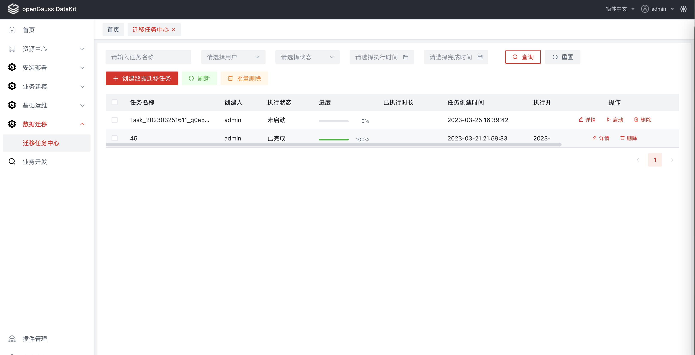
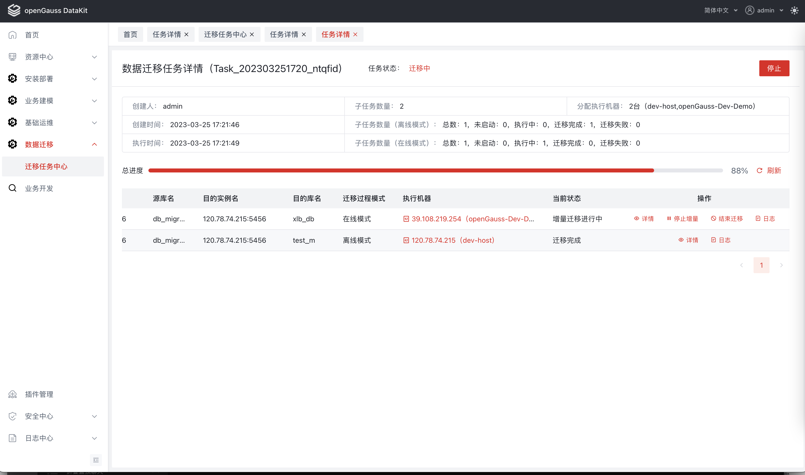
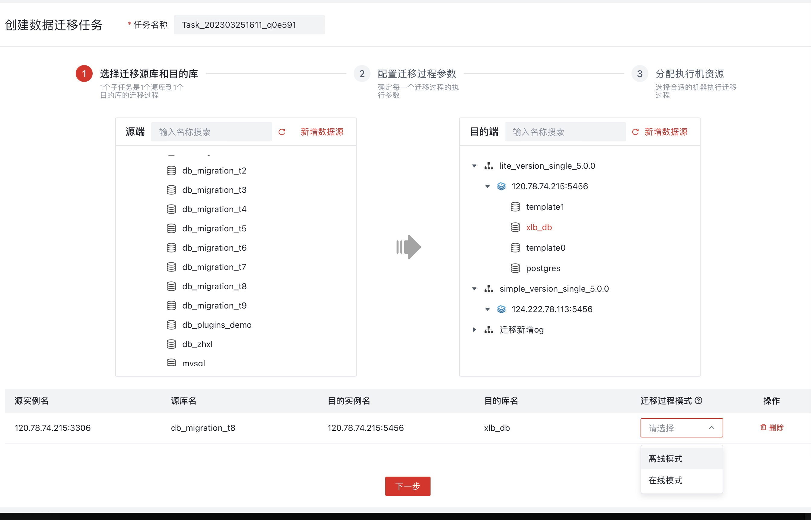
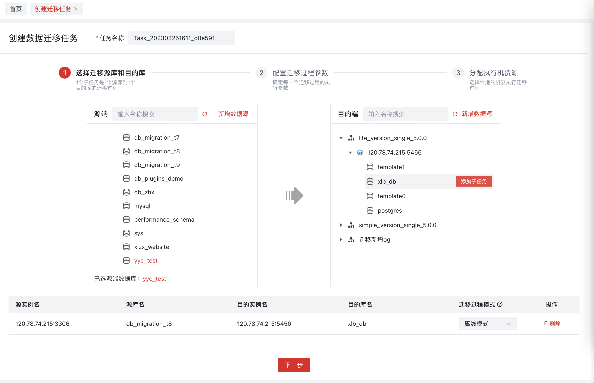
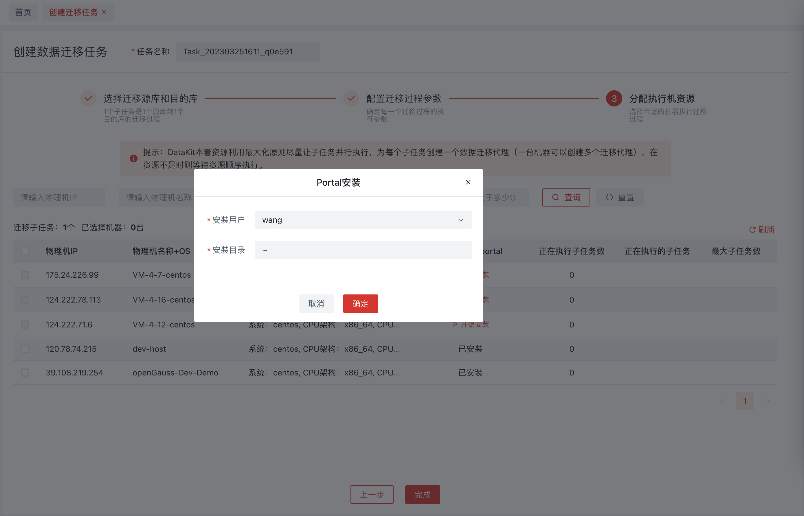

**openGauss DataKit Data Migration产品使用手册**

# **文档历史**

| **修订日期**   | **修订内容** | **版本号** | **编写人** |
|------------| --- | --- | -- |
| 2023/03/20 | 初稿  | 1.0 | 谢立波 |

# **关于本手册**

## **主要功能介绍**
该功能是为了将基于MySQL数据库的数据迁移到OpenGauss数据库而开发，并且支持数据的反向迁移。迁移模式包括在线模式（全量+增量）和离线模式（全量），同时可以批量创建任务进行并行迁移。

1、迁移任务管理：用户可以通过配置迁移任务，将单个或多个源端数据源中的数据迁移至目标数据源。

2、支持全量和增量数据的迁移：用户可以选择在线迁移（全量+增量迁移）和离线迁移（全量）两种迁移模式。

3、支持数据的反向迁移：用户可以将openGauss数据库中的数据迁移至MySQL数据库。

4、迁移过程监控：用户可以实时查看迁移进度、日志和错误信息，并进行相应的处理。

5、并发执行：用户可以创建多个迁移任务并行执行，以提高迁移效率。

6、资源动态分配：系统能够根据最大化利用原则，合理分配运行机器，以实现多任务并行迁移。

## 特性说明
1、离线模式即为全量将数据迁移到目标端数据库，全量数据迁移及校验完成后，任务完成。

2、在线模式在离线模式的基础上，增加了增量数据的迁移和反向增量数据的迁移。全量数据迁移及校验完成后自动启动增量数据迁移，增量迁移停止后，可启动反向迁移。

3、主任务状态包含：未启动、迁移中、已完成。

4、子任务状态包含：全量迁移开始、全量迁移进行中、全量迁移完成、全量校验开始、全量校验中、全量校验完成、增量迁移开始、增量迁移进行中、增量迁移已停止、反向迁移开始、反向迁移进行中、反向迁移已停止、迁移失败。

5、任务进度算法说明

+ 总任务进度算法
> 总进度 = 子任务数量 * 4
>
> 完成进度 = （全量迁移中数量 * 1 + 全量迁移完成数量 * 2 + 增量和反向迁移中数量 * 3 + 迁移完成数量 * 4）/ 总进度
>
> 全量迁移中包含状态：全量迁移开始、全量迁移进行中、全量迁移完成
>
> 全量迁移完成包含状态：全量校验开始、全量校验中、全量校验完成
>
> 增量和反向迁移中包含状态：增量迁移开始、增量迁移进行中、增量迁移已停止、反向迁移开始、反向迁移进行中、反向迁移已停止
>
> 迁移完成包含状态：离线模式的全量校验完成、迁移完成

+ 离线子任务进度算法

  离线子任务通过底层Portal的全量迁移进度数据计算状态以及进度。进度状态包含：待迁移、迁移中、迁移完成（待校验）、校验中、校验完成、错误

  > 总进度 = 表数量 * 10 + 视图数量 + 函数数量 + 存储过程数量 + 触发器数量
  >
  > 完成进度 = （表完成数量 * 10 +  视图完成数量 + 函数完成数量 + 存储过程完成数量 + 触发器完成数量）/  总进度
  >
  > + 表完成状态包含：迁移完成（待校验）、校验中、校验完成
  > + 视图完成状态包含：迁移完成（待校验）
  > + 函数完成状态包含：迁移完成（待校验）
  > + 存储过程完成状态包含：迁移完成（待校验）
  > + 触发器完成状态包含：迁移完成（待校验）

+ 在线子任务完成

  > 在线子任务只有在人工触发结束迁移才会全部完成。因此进度的计算是根据当前状态在离线迁移进度基础上乘以固定系数计算。
  >
  > 当前状态是增量迁移开始、增量迁移进行中时，完成进度 = 离线进度 * 0.85
  >
  > 当前状态是反向迁移开始、反向迁移进行中，完成进度 = 离线进度 * 0.95

## **预期读者**
测试人员

开发人员

普通用户

## **注意事项**
1、迁移过程中，请勿关闭源数据库或目标数据库；

2、执行迁移任务的服务器应具备一定的性能和配置，以保证迁移过程的顺利执行；

## 功能说明

### 迁移任务中心
该页面将展示所有的主任务，可以启动、删除、结束迁移以及查看任务详情。

#### 任务详情
如果任务未启动，打开详情将进入任务创建页面，可对任务进行修改。

如果任务已经启动，打开任务详情将进入任务详情信息页，可查看任务的进度信息以及所有子任务的迁移进度信息。

任务状态需要从底层Portal执行结果中获取，进入详情页面后会获取一次所有子任务的状态，如果需要获取最新的状态，请点击页面的刷新按钮。

在此页面可点击右侧停止按钮，让主任务结束迁移；同时可对子任务进行结束迁移、查看详情、查看日志、停止增量、启动反向、连接子任务执行机器等操作。

结束迁移：该功能提供给用户人为停止任务迁移，将停止底层Portal的执行，任务状态改为完成。

查看详情：通过右侧抽屉弹出，即时获取子任务迁移数据（表、视图、存储过程、函数、触发器）的迁移进度信息，如果是在线模式，还会显示迁移的过程记录以及增量迁移速度等信息。

查看日志：查看迁移日志，可下载日志。

停止增量：将正在增量迁移的任务进行停止。

启动反向：启动反向增量数据迁移。

连接任务执行机器： 打开webShell，登录服务器。

### 任务创建

该任务是主任务，宏观层面的任务单元，包括若干个迁移过程（子任务），子任务为具体将数据从源端迁移到目的端的执行过程。

迁移迁移任务创建任务总共分为3个步骤，分别是**配置迁移任务源库和目的库**、**源库和目的库可以直接新增数据源**、**配置迁移过程参数**。

#### **配置迁移任务源库和目的库**
该步骤需要配置迁移数据的源端和目标端数据库。首先在左侧选择源端数据库后，鼠标移动到右侧数据库上即可出现添加子任务按钮，点击按钮后，可以添加一条子任务，随后再配置子任务的迁移模式。

源库和目的库可以直接点击新增数据源进行添加。

#### **配置迁移过程参数**

该步骤可以配置任务全局参数和子任务参数。全局参数为所有子任务共享，作用于所有子任务，子任务参数只作用于自己，子任务参数优先级大于全局参数。

#### **分配执行机资源**
该步骤是配置任务运行的机器列表。机器会检测是否安装了底层迁移组件Portal，如果未安装，可以在该步骤给机器安装Portal，安装时可以选择安装用户以及安装目录；未安装Portal的机器不能执行迁移任务。

点击完成按钮后，任务将创建完成，随后将跳转到迁移任务中心页面。
### 黑暗模式
点击右上角主题模式切换，插件将跟随平台切换到对应的主题。

