**openGauss DataKit Platform产品使用手册**

# **文档历史**

| **修订日期** | **修订内容** | **版本号** | **编写人** |
| --- | --- | --- | --- |
| 2022/12/18 | 初稿  | 1.0 | 张绍鹏 |
| 2022/12/21 | 内部评审后修改 | 1.1 | 张绍鹏 |
| 2023/1/13 | 按要求改为md格式 | 1.2 | 张绍鹏 |

# **关于本手册**

## **产品介绍**

openGauss的安装、运维场景对于初级用户或单纯想要测试openGauss数据库基本特性的使用者来说技术难度较大、过程较为复杂、学习曲线较为陡峭，尤其企业版安装对一般用户来说操作难度很大。使用可视化运维平台可以屏蔽openGauss的技术细节，让普通用户能够快速上手体验功能，让运维人员能够快速在企业环境中部署、卸载各类openGauss集群，减少了用户的学习成本和运维成本，实现了对openGauss各种常见操作的可视化，屏蔽了各种不同openGauss版本中的运维命令差异，可以让用户使用相同的方式操作数据库，不用知道命令细节也可以使用openGauss数据库的各项能力，让用户可以专注于自身的业务领域。

因此需要开发一些有针对性的运维监控工具，为不同配置不同运维要求的客户提供运维技术支撑，这些都将是openGauss社区的宝贵资产。而社区急需一个一体化的平台通过插件的方式将这些工具进行整合，并支持方便快捷的个性化配置。对于社区合作伙伴已经开发的Web工具，合作伙伴也可以根据《插件开发指南》的要求自行改造为插件，整合到一体化平台中。

本产品是基于Web的openGauss的可视化的一体化平台系统，目的是方便客户使用和管理openGauss可视化工具，可以为客户降低openGauss数据库安装使用门槛，做到安全中心管理，插件管理，以及其它功能包括一键化部署、卸载、组件化安装、多版本升级、日常运维和。本文档主要适用openGauss3.0.0+版本。

## **主要功能介绍**

本产品主要包含以下几个功能特性：

- 插件平台（详见平台开发文档，该手册不再赘述）
- 用于插件开发的前后端一体的开发框架（详见插件开发文档，该手册不再赘述）
- Mysql数据迁移工具插件实现
- 安全中心（账号管理、角色权限管理和白名单管理）
- 插件管理模块
- 日志中心，包括操作日志和系统日志（日志级别/切割规则/保留天数的设置和日志下载）
- 国际化（中/英）
- 主题切换（黑/白）
- 基础模块（用户中心、修改个人密码、登录/登出）

## **预期读者**

- 用户
- 测试人员
- 开发人员

## **名词解释**

| **名词**   | **解释**                   | **备注**                                           |
| ---------- | -------------------------- | -------------------------------------------------- |
| 超级管理员 | 系统安装后即可用的内置账号 | 该账号不可删除，而且是唯一可以访问“安全中心”的账号 |
|            |                            |                                                    |
|            |                            |                                                    |
|            |                            |                                                    |
|            |                            |                                                    |
|            |                            |                                                    |
|            |                            |                                                    |
|            |                            |                                                    |

## 

## **版本及功能列表**

| **版本号** | **新增功能** | **发布时间** |
| --- | --- | --- |
| V1.0 | 首次发布 | 2022-12-18 |

## **平台基础模块（登录/登出/用户中心/密码）**

### **概述**

平台基础模块包括登录平台，登出平台，修改密码，用户中心

### **角色**

所有用户

### **界面**

1、登录平台

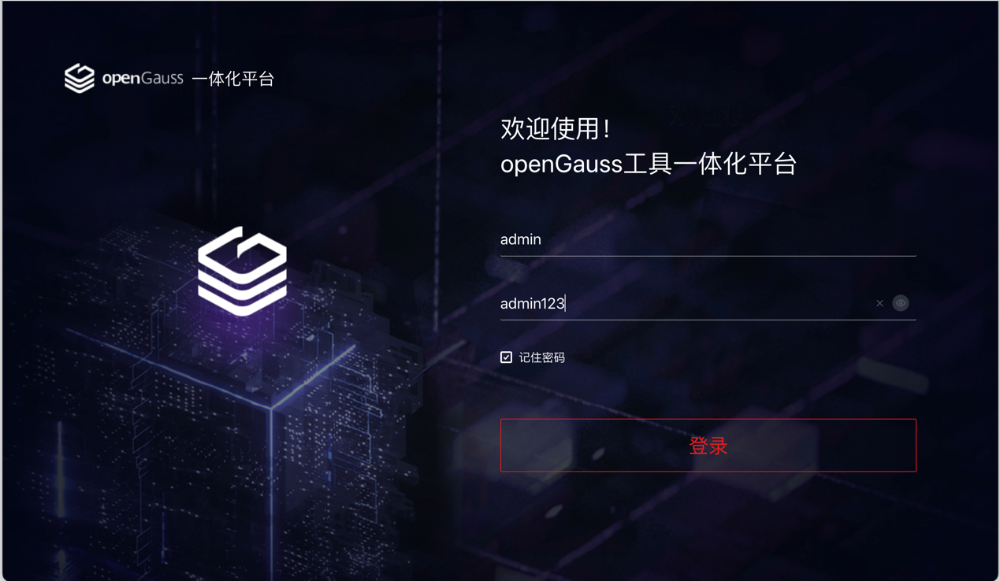

2、退出登录

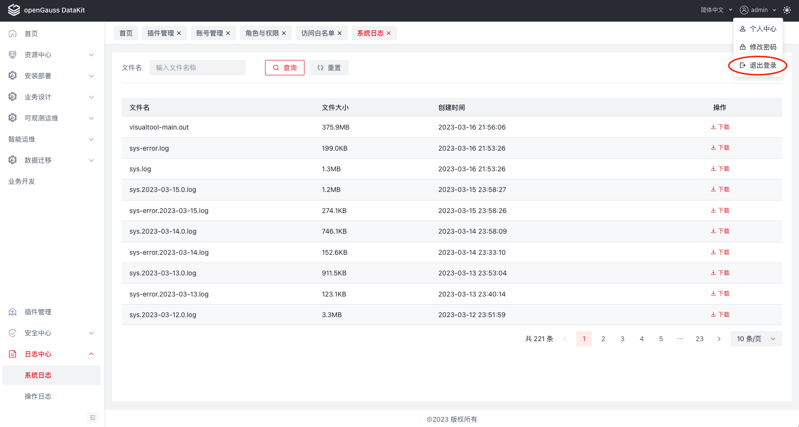

3、修改密码

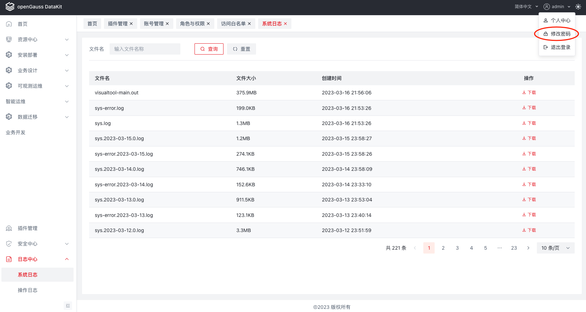

4、用户中心

点击用户中心

点击用户名旁边的“编辑”图标

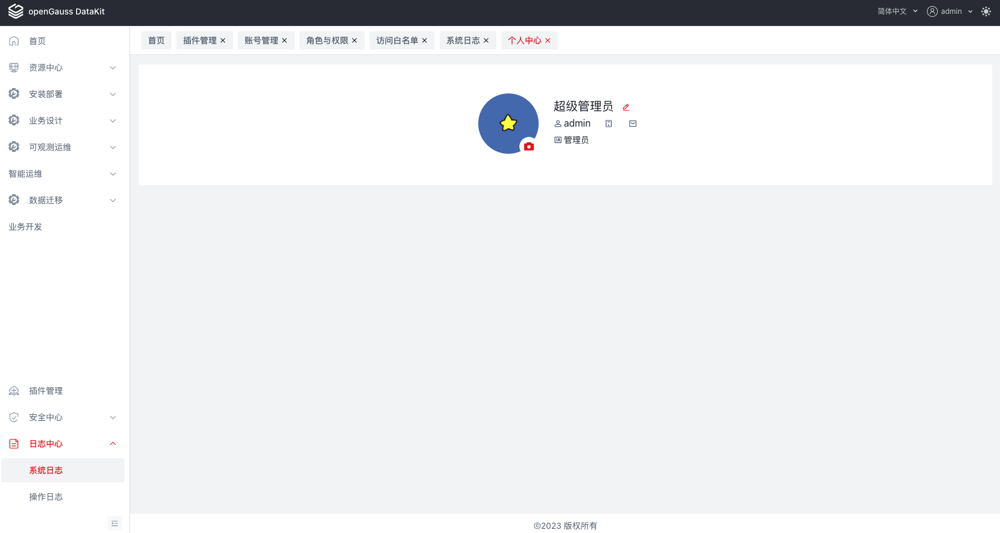

修改用户信息，包括：

- 账号名
- 用户昵称
- 手机号码（系统会检查唯一性）
- 邮箱（optional）

点击更换头像，弹窗选择图片上传，Upload success后显示出头像

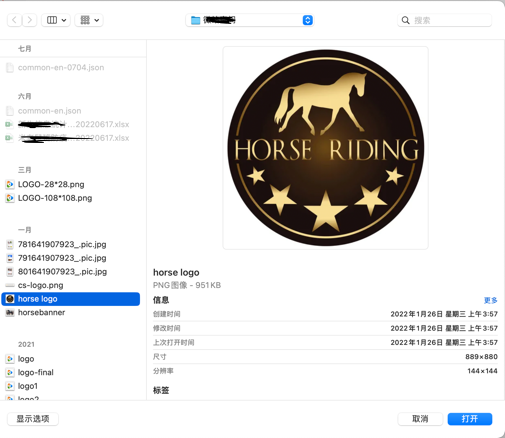

## **国际化和黑白主题**

### **概述**

本平台支持国际化热切换（中文和英文），支持黑白主题切换。

### **角色**

所有用户

### **界面**

1.  切换语言

**切换到英文后的效果：**

1.  切换主题

**点击右上角的太阳/月亮图标即可切换主题：**

点击右上角太阳/月亮按钮进行黑白主题toggle切换

黑色主题的效果：

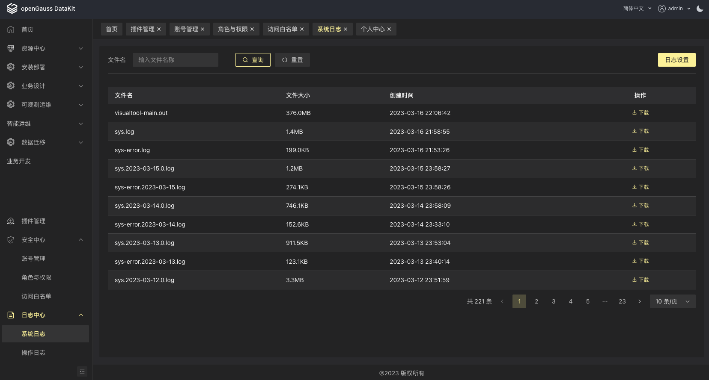

## **插件管理页面**

### **概述**

在本页面可以完成对插件的集中管理，包括以下操作：插件一览，安装插件，卸载插件，停用插件，启用插件等。

### **角色**

拥有插件管理权限的角色可以访问

### **界面**

1、插件一览

**说明：**

每个插件包括以下信息：

- 图标
- 名称
- 版本
- 开发者
- 简介

2、安装插件

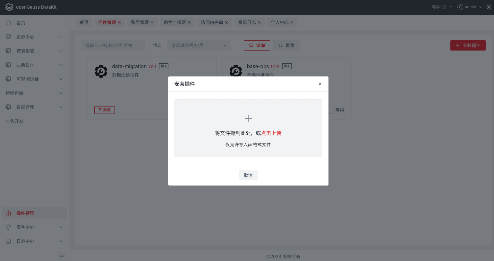

**说明：**

- 在插件管理页面，点击右上角“安装插件”按钮
- 将插件jar包拖拽到窗口里 或 打开文件选择器选择插件jar包
- 点击“播放”按钮进行安装
- 安装成功后：插件一览列表会出现对应的插件信息卡片，左侧系统菜单会出现插件相关的菜单项。

3、卸载插件

为了提供更灵活的菜单配置能力，平台允许插件创建二级菜单。又为了让同类插件的菜单可以归类于一级菜单下，平台也允许插件在其它插件菜单下创建二级菜单，这样就会存在插件菜单间的依赖，所以在卸载插件时要注意：

*如果其它插件在你的插件菜单下创建了子菜单项，那你需要先卸载那个插件消除依赖后才能卸载你的插件。*

插件被卸载后，该插件下的所有Tab标签页都会被自动关闭。

## **安全中心**

### **概述**

安全中心提供登录权限和账号管理，以及访问白名单管理。

### **角色**

出于安全性设计的考量，平台只允许超级管理员（即安装后就有的系统内置账号）可以访问安全中心。其它Role配置权限时甚至看不到安全中心的菜单，所以也无法给其它Role配置安全中心的权限。

### **界面**

1、白名单管理

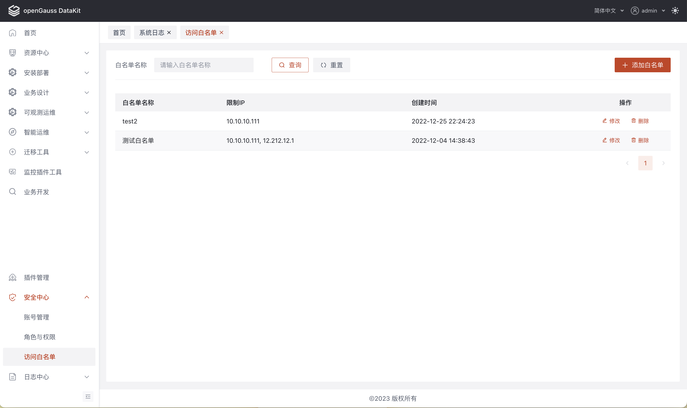

**说明：**

- 左侧菜单栏找到“安全中心-访问白名单”菜单，点击打开“白名单管理”页面；
- 点击右上角“添加白名单”按钮
- 在弹出框中填写白名单名称和允许访问的IP地址，多个IP地址间用逗号隔开，确认即可完成添加。

2、角色与权限菜单

本系统支持通过创建特定的权限组合来管理用户权限，权限组合被定义为“角色”，一个用户只能拥有一个角色。

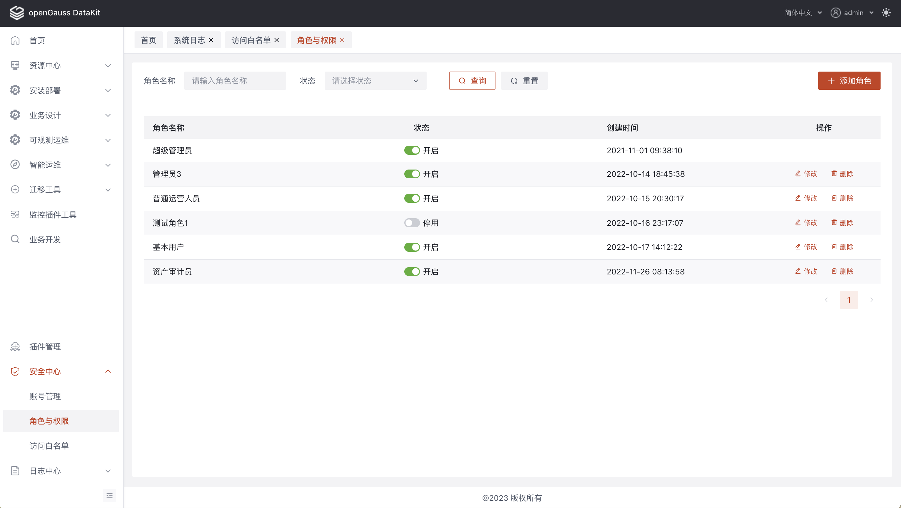

点击“添加角色”

创建或编辑“角色”时，可以为“角色”配置权限范围，包括已经安装的插件的访问权限。

*注意：出于安全性设计的考虑，任何添加的”角色“都无法拥有”安全中心“的访问权限，”安全中心“的权限被固定在”超级管理员“身上。*

**说明：**

- 左侧菜单栏找到“安全中心-角色菜单”，点击打开“角色菜单”管理页面；
- 点击右上角“添加角色”按钮
- 在弹出框中填写角色名称，并勾选允许访问的菜单项，可以选择多个菜单项，可以全选，可以添加备注，确认即可完成添加。

3、账号与权限

**说明：**

- 左侧菜单栏找到“安全中心-账号与权限”，点击打开“账号与权限”管理页面；
- 点击右上角“添加用户”按钮
- 在弹出框中填写以下字段：
    - 账号：登录用户名
    - 密码：登录密码
    - 昵称：
    - 手机号码：唯一手机号
    - 角色：不选择角色则没有任何权限
    - 状态：启用或停用
    - 备注：可选填

点击确定完成添加账号。

点击“重置密码”可以为某个用户重置密码

## **日志中心**

### **概述**

日志中心提供系统日志管理和操作日志管理功能。

### **角色**

拥有日志中心访问权限的账号均可以访问该功能。

### **界面**

1、系统日志

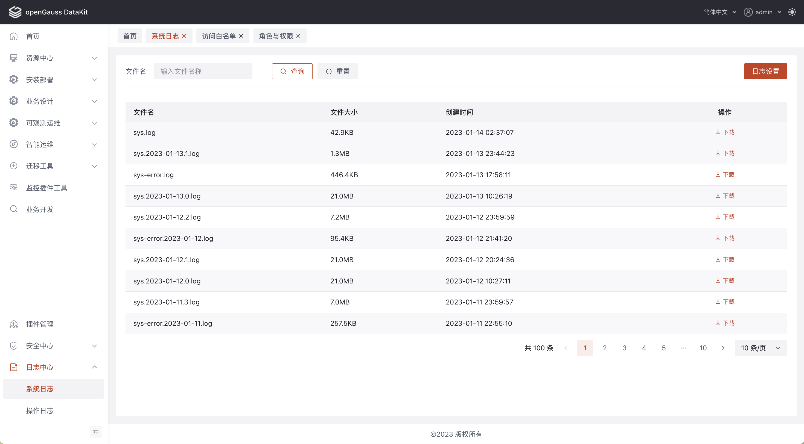

**说明：**

- 左侧菜单栏找到“日志中心-系统日志”，点击打开“系统日志”管理页面；
- 可以通过搜索找到对应的日志文件，点击下载日志文件
- 点击右上角“日志设置”按钮
- 在弹出框中进行系统日志配置：
    - 日志输出级别：四个级别DEBUG，INFO，WARN，ERROR
    - 保留天数：输入天数，操作天数的日志会被自动清除
    - 单个日志文件大小：单个日志文件达到这个限制会自动创建新的日志文件
    - 最大占用空间：所有日志文件被允许占用的最大存储空间

2.  操作日志

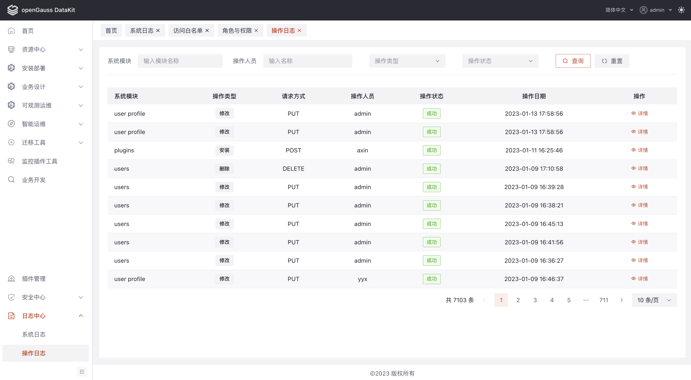

**说明：**

1左侧菜单栏找到“日志中心-操作日志”，点击打开“操作日志”管理页面；

2可以通过搜索找到对应的日志文件

3点击“详情”查看该操作的详细参数

## **mysql数据迁移工具**

### **概述**

Mysql数据迁移工具提供将mysql数据库的数据迁移到openGauss系统的能力（目前只支持全量迁移）

> 注意：该插件的功能后续会被更全面的基于最新数据迁移portal的可视化插件取代。

### **角色**

拥有该插件访问权限的账号均可以访问该功能。

### **界面**

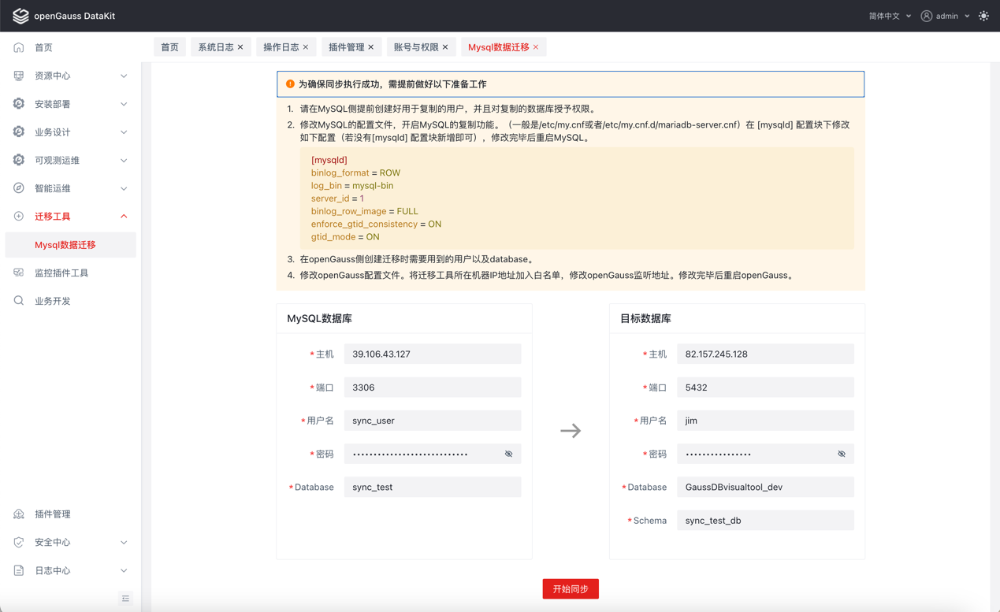

**说明：**

1.  安装该插件
2.  在左侧菜单栏找到“迁移工具-Mysql数据迁移”，点击打开“Mysql数据迁移”插件页面；
3.  点击头部提示栏查看需要做的准备工作
4.  配置好要迁移的MySQL数据库信息和目标数据库信息
5.  点击“开始同步”
6.  等待同步完成

注意：一次只能启动一个数据同步过程。