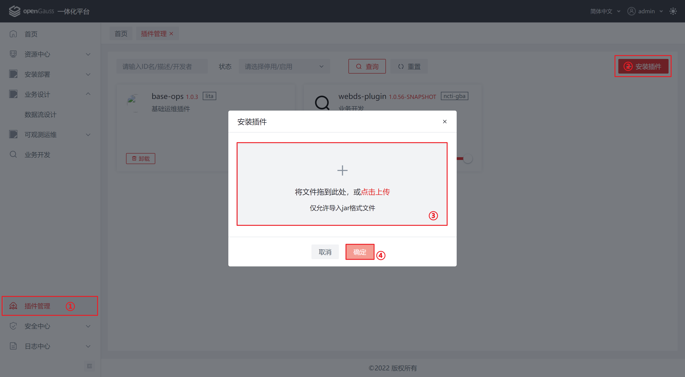
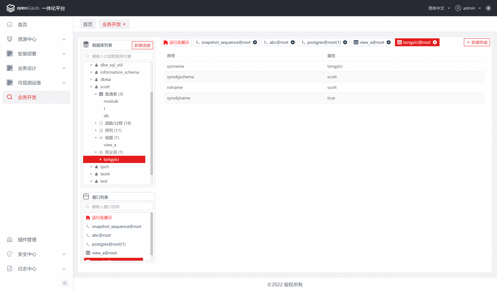
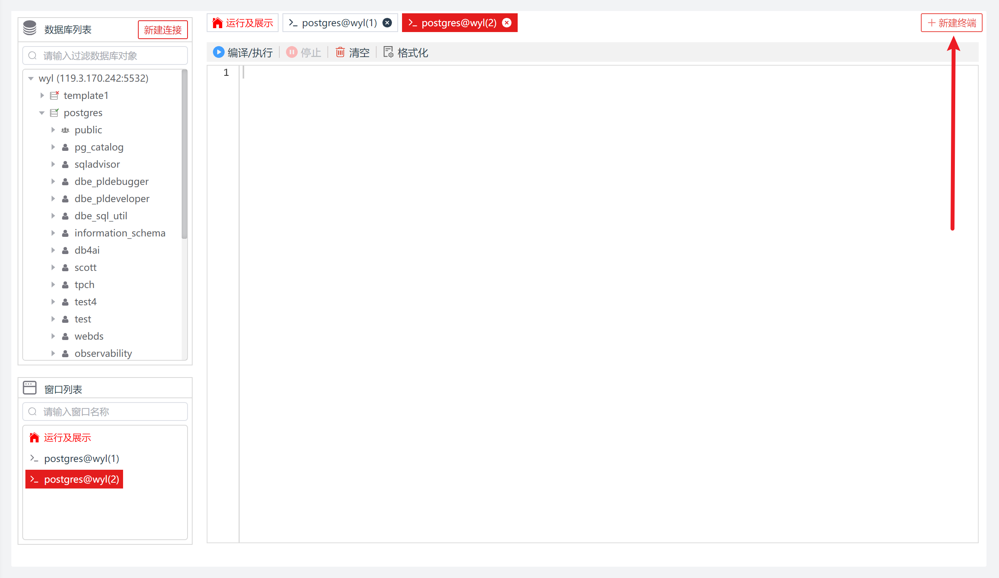
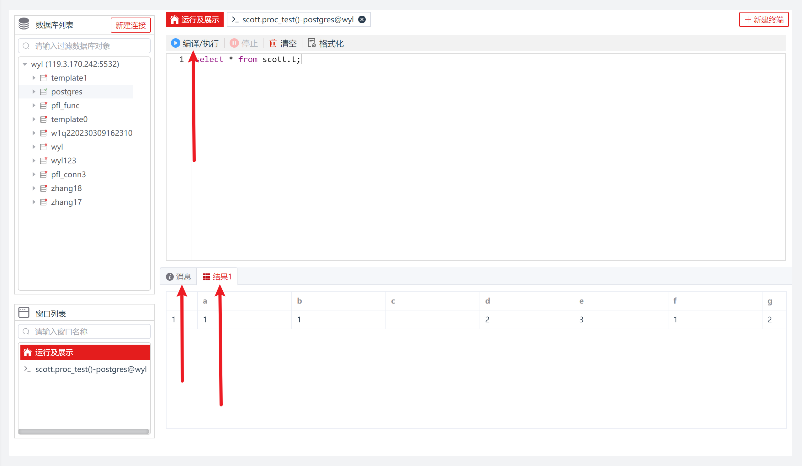
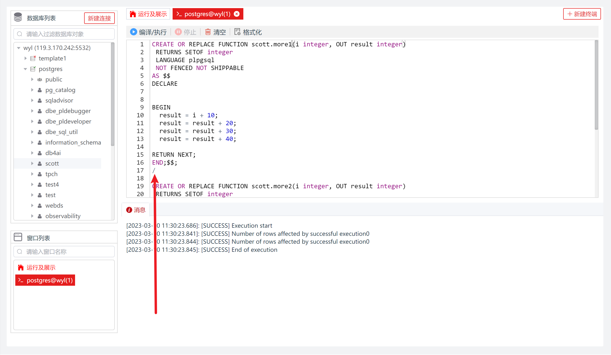
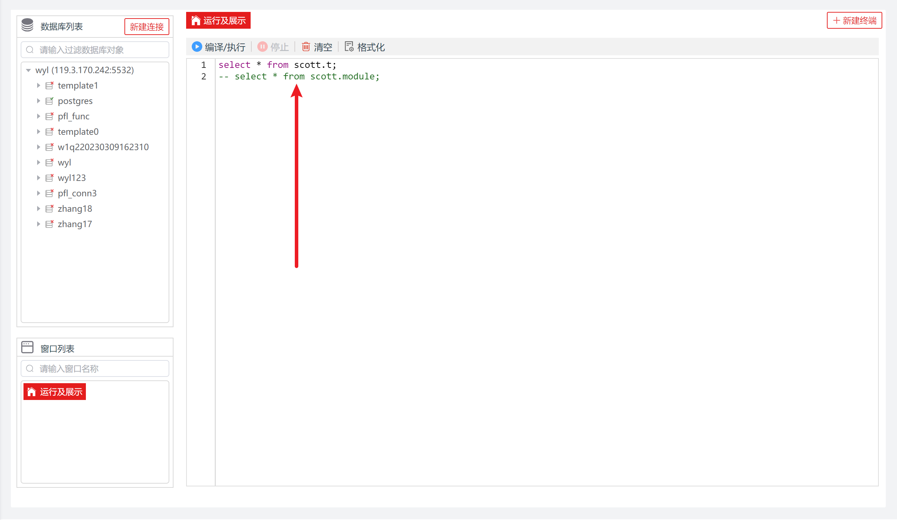
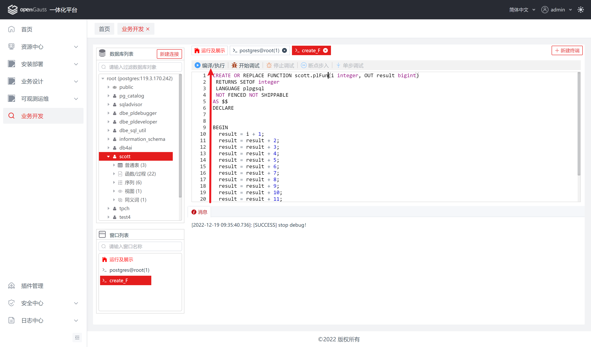
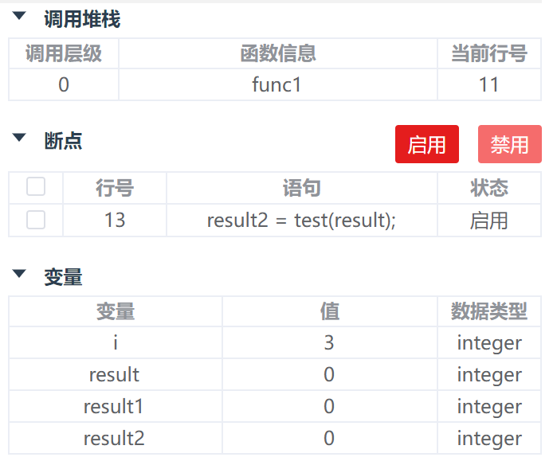
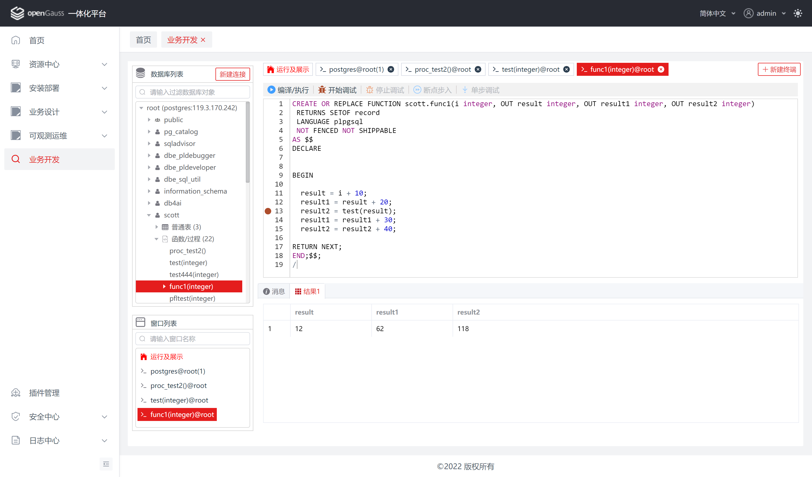

# 1业务开发 (Web Data Studio) 用户手册


## 1业务开发 (Web Data Studio) 用户手册

​	业务开发 (Web Data Studio) 是一个基于 Browser/Server 通用集成开发环境，它以插件形式安装部署于 openGauss 一体化平台，简化了openGauss 数据库的开发和管理。

​	业务开发 (Web Data Studio) 帮助数据库开发人员便捷地构建应用程序，以图形化界面形式提供数据库关键特性。它允许数据库开发人员仅需掌握少量的编程知识，即可使用该工具进行数据库对象操作，如：

- 创建和管理数据库对象

- 执行 SQL 语句或 SQL 脚本

- 编辑和执行 PL/SQL 语句

  

## 2 前言


### 2.1 概述

​	本章介绍手册相关信息。


### 2.2 读者对象

​	本手册主要适用于以下人员：

- 数据库开发人员
- 数据库管理员


### 2.3 修订记录

| 日期       | 版本   | 变更说明     |
| ---------- | ------ | ------------ |
| 2022/12/19 | v1.0.0 | 新增编译初版 |


### 2.4 文档约定

​	本节描述了本手册的（内容、符号、GUI 和文本）约定。 

**图形化界面格式约定**

​    	本手册中可能出现下列图形化界面格式约定，它们所代表的含义如下。

| 格式 | 说明                                                         |
| ---- | ------------------------------------------------------------ |
| 粗体 | 按钮、菜单、参数、页签、窗口及对话框标题均使用粗体并用引号括起来。例如，单击“**确定**”。 |


### 2.5 第三方许可证

​	本节包含适用于该插件的第三方许可证。

​	**表2-1 第三方软件列表**

| 第三方软件     |
| -------------- |
| 木兰宽松许可证 |


### 2.6 参考文档

​	使用业务开发 (Web Data Studio) 可参考下表中文档：

​	**表2-2 参考文档**

| 文档名称           | 目的       |
| ------------------ | ---------- |
| openGauss 产品文档 | 数据库参考 |


## 3业务开发 (Web Data Studio) 简介


### 3.1 概述

​	业务开发 (Web Data Studio) 通过提供图形化界面来展示数据库的主要功能，简化了数据库开发和应用构建任务。

​	数据库开发人员可以使用业务开发 (Web Data Studio) 所提供的特性：

- 创建和管理数据库对象
- 执行 SQL 语句或 SQL 脚本
- 编辑和执行 PL/SQL 语句

   管理数据库对象包括：

- 函数
- 存储过程
- 表
- 序列
- 视图
- 同义词


### 3.2 支持的功能

​	业务开发 (Web Data Studio) 支持 openGauss 数据库。

​	业务开发 (Web Data Studio) 对 openGauss 数据库提供的功能如下：

​    **连接信息**

- 新建连接
- 编辑连接
- 查看连接属性

​	**管理表**

- 查看 DDL
- 查看列
- 查看约束
- 查看索引
- 查看数据

​	**序列**

- 创建序列
- 删除序列
- 查看 DDL

​	**视图**

- 创建视图
- 删除视图
- 查看 DDL
- 查看数据

​	**同义词**

- 创建同义词
- 删除同义词
- 查看同义词属性

​	**SQL 终端**

- 打开多个"SQL 终端"页签
- 使用 SQL 查询
  - 使用 SQL 单条查询
  - 执行多条函数/过程或查询
  - 注释/取消注释
  - 插入空格/取消插入空格

​	**函数/过程**

- 创建函数/过程
- 使用函数/过程
  - 删除函数/过程
  - 执行函数/过程
- 调试函数/过程
  - 使用断点
  - 控制执行
  - 查看堆栈信息


### 3.3 约束和限制

**函数/过程**

在“**SQL** **终端**”或“**创建函数**/**过程**”向导创建的函数/过程须以“/”结尾，表示函数/过程的结尾。函数/过程随后输入的语句结尾如果没有“/”，语句会被视为单条查询，执行过程中可能会报错。


**调试**

前置条件：① 安装openGauss3.1.0

​                    ② 安装 pldebugger 插件

仅支持plpgsql语言的调试


**项目运行**

本项目依赖主平台的web-socket，若需要使用本项目所有功能，只能通过编译成 jar 包的形式作为插件运行在主平台上，若需单独运行将影响 SQL 终端语句执行、调试函数/过程等功能的使用。


### 3.4 插件业务开发 (Web Data Studio) 项目结构

下载业务开发 (Web Data Studio) 项目代码

```
git clone 地址待更新
```

业务开发 (Web Data Studio) 项目结构如下图所示：

业务开发 (Web Data Studio) 项目结构说明如下：

| 文件夹/文件 | 说明                   |
| ----------- | ---------------------- |
| src         | 保存后端代码及资源文件 |
| web-ui      | 保存前端代码           |
| .gitignore  | 提交git忽略的目录      |
| pom.xml     | 后端依赖项             |
| LICENSE     | 许可证                 |

### 3.5 系统要求

​	本节介绍使用业务开发 (Web Data Studio) 的最低系统要求。

**浏览器要求**

| 操作系统 | 版本           |
| -------- | -------------- |
| windows  | windows7及以上 |

**业务开发 (Web Data Studio) 软件要求**

| 软件 | 规格         |
| ---- | ------------ |
| Java | jdk 11及以上 |

**数据库版本要求**

| 数据库    | 版本                         |
| --------- | ---------------------------- |
| openGauss | 所有（debug功能需3.0.0以上） |


## 4 部署业务开发 (Web Data Studio)

​	 本章详细介绍如何部署业务开发 (Web Data Studio)。

​     前端技术栈：Vue3.0 + TS + Element plus

​     后端技术栈：Java + Spring boot

### 4.1 编译项目并部署至一体化平台

**前置条件：**① 安装 node.js，建议使用 v16 以上版本

​                   ② 安装Java jdk （建议使用v11及以上版本） 和 maven 3.X

**步骤 1：** 检查自动构建前端项目的配置是否为false

```
在 plugins > data-studio > pom.xml 下将以下值设为false：
<web.build.skip>false</web.build.skip>
<web.clean.skip>false</web.clean.skip>
```

**步骤 2：** 启动打包命令

```
mvn clean package -P prod
```

**步骤 3：**在target目录下找到生成的jar，安装到一体化平台



### 4.2 启动后端项目

**前置条件**：安装Java jdk （建议使用v11及以上版本） 和 maven 3.X。

**步骤 1：**使用idea打开项目，并配置好maven

**步骤 2：**通过启动后端命令与前端命令的方式进入，此方式受限制，详情请参见 3.3 约束和限制

​                **步骤 2-1：**找到 DataStudioPluginApplication 类，执行 main 函数


​             **步骤2-2：**启动业务开发 (Web Data Studio) 前端项目，请参见 4.3 启动前端项目。

### 4.3 启动前端项目

**前置条件：**安装 node.js，建议使用 v16 以上版本。

**步骤 1：**下载依赖包 

```
 任选以下一种命令：
 npm install
 cnpm install
 yarn 
```

**步骤 2：**启动前端项目

```
 根据package.json配置任选以下一种命令：
 npm run dev
 npm run lint
 npm run lint:prettier
```

**步骤 3：** 根据启动提示进入对应的URL地址，如下图所示：


## 5 使用业务开发 (Web Data Studio)

### 5.1 概述

​	本章详细介绍如何使用业务开发 (Web Data Studio) 的功能。建立有效的数据库连接后，方可使用业务开发 (Web Data Studio) 对数据库执行操作。

### 5.2 连接信息

​	业务开发 (Web Data Studio) 启动后，默认打开 **“新建连接”** 对话框。要执行数据库操作，业务开发 (Web Data Studio) 需连接至少一个数据库。

#### 5.2.1 新建连接

**步骤 1： **在左侧数据库列表选择 **“新建连接”** 弹出 **"新建连接"**对话框。 

**步骤 2：** 该连接对话框的左侧列表中显示已有的连接信息和服务器信息。

​			    **说明：**双击连接名称，可自动填充 “**名称**”、“**主机名**” 和 “**端口号**” 等连接参数。

**步骤 3：**设置如下参数，创建数据库连接。

​			   **说明：**所有必选参数均需要填写。必填参数用星号（*）标识。

| 配置项     | 必填 | **组件形式** | 配置说明                                                     |
| ---------- | ---- | ------------ | ------------------------------------------------------------ |
| 数据库类型 | 是   | 下拉框       | 1）该配置项用于选择数据库类型  2）默认为openGauss，不可选，置灰状态 |
| 名称       | 是   | 输入框       | 1）该配置项用于填写连接名称  2）默认为空  3）限制字符个数不大于30 |
| 主机       | 是   | 输入框       | 1）该配置项用于填写ip地址    2）默认为空   3）输入内容需要符合ip地址规范，若填写内容不符合规范，则配置项组件标红且提示“填写内容不符合ip地址规范，请确认是否填写有误” |
| 端口号     | 是   | 输入框       | 1）该配置项用于填写数据库端口  2）默认为5432  3）输入内容需要符合端口号范围，即0-65535，若填写内容不符合规范，则配置项组件标红且提示“填写内容不符合端口范围，请确认是否填写有误” |
| 数据库     | 是   | 输入框       | 1）该配置项用于填写数据库名  2）默认为postgres  3）若填写内容不符合规范，则配置项组件标红且提示“数据库名不能为空” |
| 用户名     | 是   | 输入框       | 1）该配置项用于填写连接数据库的用户名  2）默认为空  3）若填写内容不符合规范，则配置项组件标红且提示“用户名不能为空” |
| 密码       | 是   | 输入框       | 1）该配置项用于填写连接数据库的密码  2）默认为空  3）支持显示和隐藏密码3）若填写内容不符合规范，则配置项组件标红且提示“密码不能为空” |


#### 5.2.2 编辑连接

​	            执行以下步骤编辑数据库连接属性：

**步骤 1：**在 "**数据库列表**" 窗格中，右键单击连接名称，选择 "**编辑连接**" ，弹出 "**编辑连接**" 对话框。

**步骤 2：**单击 "**确定**" 即可继续，或单击 "**取消**" 即可退出操作。

**步骤 3：**编辑连接参数详细说明，请参见 5.2.1 添加连接。

​			   **说明**：单击 "**确定**" 将保存更新后的连接信息。

​                        单击 "**清空**" 即可清除 "编辑连接"对话框中的所有字段。

​                        单击 "**取消**" 即可退出本次对话框操作。


#### 5.2.3 查看连接属性

​               执行以下步骤编辑数据库连接属性：

**步骤 1：**在 "**数据库列表**" 窗格中，右键单击连接名称，选择 "**连接属性**" ，弹出 "**连接属性**" 对话框，对话框将显示所选连接的属性。


### 5.3 表管理

​	目前业务开发 (Web Data Studio) 表管理仅支持查看，查看内容包含 DDL、列、约束、索引、数据5大维度。

#### 5.3.1 查看 DDL

​               执行以下步骤查看 DDL：

**步骤 1：**在 "**数据库列表**" 窗格中，单击普通表列表，业务开发 (Web Data Studio) 将显示所选表对应的5大维度内容，默认显示 DDL。

​               **说明**：当前显示数据仅在首次加载时自动获取，若需更新数据请点击刷新按钮。


#### 5.3.2 查看列

​               执行以下步骤查看列：

**步骤 1：**在 "**数据库列表**" 窗格中，单击普通表列表，业务开发 (Web Data Studio) 将显示所选表对应的5大维度内容，选中 "**列**"。

​               **说明**：当前显示数据仅在首次加载时自动获取，若需更新数据请点击刷新按钮。


#### 5.3.3 查看约束

​               执行以下步骤查看约束：

**步骤 1：**在 "**数据库列表**" 窗格中，单击普通表列表，业务开发 (Web Data Studio) 将显示所选表对应的5大维度内容，选中 "**约束**"。

​               **说明**：当前显示数据仅在首次加载时自动获取，若需更新数据请点击刷新按钮。


#### 5.3.4 查看索引

​               执行以下步骤查看索引：

**步骤 1：**在 "**数据库列表**" 窗格中，单击普通表列表，业务开发 (Web Data Studio) 将显示所选表对应的5大维度内容，选中 "**索引**"。

​               **说明**：当前显示数据仅在首次加载时自动获取，若需更新数据请点击刷新按钮。


#### 5.3.5 查看数据

​              执行以下步骤查看数据：

**步骤 1：**在 "**数据库列表**" 窗格中，单击普通表列表，业务开发 (Web Data Studio) 将显示所选表对应的5大维度内容，选中 "**数据**"。

​               **说明**：当前显示数据仅在首次加载时自动获取，若需更新数据请点击刷新按钮。


### 5.4 序列

​	业务开发 (Web Data Studio) 序列支持创建、删除以及查看 DDL。

#### 5.4.1 创建序列

​	           执行以下步骤创建序列：

**步骤 1：**在 "**数据库列表**" 窗格中，右键 "**序列**"，选择 "**创建序列**"，弹出 "**创建序列**" 对话框。

**步骤 2：**选择 "**基本**"，设置如下参数，创建序列。

​			   **说明：**所有必选参数均需要填写。必填参数用星号（*）标识。

​			             单击 "**确定**" 将创建并保存更新后的序列信息。

​                         单击 "**重置**" 即可重置 "**创建序列**"对话框中的所有字段。

​                         单击 "**取消**" 即可退出本次对话框操作。

| 配置项   | 必填 | 组件形式 | 数据类型限制 | 配置说明                                                     |
| -------- | ---- | -------- | ------------ | ------------------------------------------------------------ |
| 名称     | 是   | 输入框   | 文本         | 用于定义序列名称，默认为空                                   |
| 增量     | 否   | 输入框   | 整数         | 用于定义序列的步长；默认为空，若省略，则数据库设置默认为1，若出现负值，则代表序列的值是按照此步长递减 |
| 起始值   | 否   | 输入框   | 整数         | 用于定义序列的初始值(即产生的第一个值)；默认为空，若省略，则数据库设置默认为1 |
| 最小值   | 否   | 输入框   | 整数         | 用于定义序列生成器能产生的最小值；默认为空，若省略，则代表没有最小值定义，这时对于递减序列，系统能够产生的最小值的取值范围应在-9223372036854775808；对于递增序列，最小值是1 |
| 最大值   | 否   | 输入框   | 整数         | 用于定义序列生成器能产生的最大值 ；默认为空，若省略，则代表没有最大值定义，这时对于递增序列，系统能够产生的最大值是 9223372036854775807 ；对于递减序列，最大值是-1 |
| 缓存数值 | 否   | 输入框   | 整数         | 用于定义存放序列的内存块的大小；默认为空，若省略，则数据库默认设置为20；对序列进行内存缓冲，可以改善序列的性能 |
| 循环     | 否   | 开关     | -            | 用于定义当序列生成器的值达到限制值后是否循环；默认为不循环，若循环，则当递增序列达到最大值时，循环到最小值;对于递减序列达到最小值时，循环到最大值。如果不循环，达到限制值后，继续产生新值就会发生错误。 |
| 模式     | 是   | 下拉框   | -            | 用于定于所属对象模式；默认为当前模式，置灰不可选             |
| 表       | 否   | 下拉框   | -            | 用于选择所属对象模式下对应的表；默认为空，若省略，默认仅指向上一级，即模式 |
| 列       | 否   | 下拉框   | -            | 用于选择所属对象模式下指定表对应的列；默认为空，若省略，默认指向指定项的上一级，即表、模式 |


**步骤 3：**选择 "**SQL预览**"，可基于创建序列的配置信息进行 SQL 预览。

​               **说明：**若未填写 "**基本**" 必填项，将无法通过校验进入 "**SQL预览**" 界面。

​                          "**SQL预览**" 界面的编辑框仅支持查看，不支持编辑。


#### 5.4.2 删除序列

​	           执行以下步骤删除序列：

**步骤 1：**在 "**数据库列表**" 窗格中，右键序列列表，选择 "**删除序列**"，弹出 "**删除序列**" 确认框。

**步骤 2：**单击 "**确定**" 即可继续，或单击 "**取消**" 即可退出操作。

​               **说明：**单击 "**确定**" 将删除并更新序列信息，此操作不可逆。

​                         单击 "**取消**" 即可退出本次对话框操作。


#### 5.4.3 查看 DDL

​	           执行以下步骤查看 DDL：

**步骤 1：**在 "**数据库列表**" 窗格中，单击序列列表，将显示序列 DDL。


### 5.5 视图

#### 5.5.1 创建视图

​               执行以下步骤创建视图：

**步骤 1：**在 "**数据库列表**" 窗格中，右键 "**视图**"，选择 "**创建视图**"，弹出 "**创建视图**" 对话框。

**步骤 2：**选择 "**基本**"，设置如下参数，创建视图。

​			   **说明：**所有必选参数均需要填写。必填参数用星号（*）标识。

​			              单击 "**确定**" 将创建并保存更新后的视图信息。

​                          单击 "**重置**" 即可重置 "**创建视图**"对话框中的所有字段。

​                          单击 "**取消**" 即可退出本次对话框操作。

| 配置项       | 必填 | 组件形式  | 数据类型限制 | 配置说明                                               |
| ------------ | ---- | --------- | ------------ | ------------------------------------------------------ |
| 名称         | 是   | 输入框    | 文本         | 用于定义视图名称，默认为空                             |
| 类型         | 是   | 下拉框    | -            | 用于定义视图类型，类型分别为视图、物化视图，默认为视图 |
| 所需对象模式 | 是   | 下拉框    | -            | 用于定于所属对象模式，默认为当前模式，置灰不可选       |
| 代码         | 是   | sql编辑器 | sql语句      | 用于编写sql语句，默认为空                              |


**步骤 3：**选择 "**SQL预览**"，可基于创建视图的配置信息进行 SQL 预览。

​               **说明：**若未填写 "**基本**" 必填项，将无法通过校验进入 "**SQL预览**" 界面。

​                         "**SQL预览**" 界面的编辑框仅支持查看，不支持编辑。


#### 5.5.2 删除视图

​	           执行以下步骤删除视图：

**步骤 1：**在 "**数据库列表**" 窗格中，右键视图列表，选择 "**删除视图**"，弹出 "**删除视图**" 确认框。

**步骤 2：**单击 "**确定**" 即可继续，或单击 "**取消**" 即可退出操作。

​               **说明：**单击 "**确定**" 将删除并更新视图信息，此操作不可逆。

​                         单击 "**取消**" 即可退出本次对话框操作。


#### 5.5.3 查看 DDL

​               执行以下步骤查看 DDL：

**步骤 1：**在 "**数据库列表**" 窗格中，单击视图列表，所选视图对应的2大维度内容，默认显示DDL。

​               **说明**：当前显示数据仅在首次加载时自动获取，若需更新数据请点击刷新按钮。


#### 5.5.4 查看数据

​               执行以下步骤查看数据：

**步骤 1：**在 "**数据库列表**" 窗格中，单击视图列表，所选视图对应的2大维度内容，选中 "**数据**"。

​               **说明**：当前显示数据仅在首次加载时自动获取，若需更新数据请点击刷新按钮。


### 5.6 同义词

#### 5.6.1 创建同义词

​               执行以下步骤创建同义词：

**步骤 1：**在 "**数据库列表**" 窗格中，右键 "**同义词**"，选择 "**创建同义词**"，弹出 "**创建同义词**" 对话框。

**步骤 2：**选择 "**基本**"，设置如下参数，创建同义词。

​			   **说明：**所有必选参数均需要填写。必填参数用星号（*）标识。

​			             单击 "**确定**" 将创建并保存更新后的同义词信息。

​                         单击 "**重置**" 即可重置 "**创建同义词**"对话框中的所有字段。

​                         单击 "**取消**" 即可退出本次对话框操作。

| 配置项           | 必填 | 组件   | 数据类型限制 | 配置说明                                                     |
| ---------------- | ---- | ------ | ------------ | ------------------------------------------------------------ |
| 名称             | 是   | 输入框 | 文本         | 用于定义同义词名称；默认为空                                 |
| 对象所有者       | 是   | 下拉框 | -            | 用于指定同义词归属者；默认为空，选项为所有用户模式           |
| 对象类型         | 是   | 下拉框 | -            | 用于指定同义词对象类型；默认为all，选项为all、函数/过程、视图、普通表 |
| 对象名称         | 是   | 下拉框 | -            | 用于指定同义词对象类型下的名；默认为空，选项为所选对象类型下的子项 |
| 替换已存在同义词 | 否   | 开关   | -            | 用于替换已存在的同义词；默认为关闭，即不替换                 |


**步骤 3：**选择 "**SQL预览**"，可基于创建同义词的配置信息进行 SQL 预览。

​               **说明：**若未填写 "**基本**" 必填项，将无法通过校验进入 "**SQL预览**" 界面。

​                         "**SQL预览**" 界面的编辑框仅支持查看，不支持编辑。


#### 5.6.2 删除同义词

​	           执行以下步骤删除同义词：

**步骤 1：**在 "**数据库列表**" 窗格中，右键同义词列表，选择 "**删除同义词**"，弹出 "**删除同义词**" 确认框。

**步骤 2：**单击 "**确定**" 即可继续，或单击 "**取消**" 即可退出操作。

​               **说明：**单击 "**确定**" 将删除并更新同义词信息，此操作不可逆。

​                         单击 "**取消**" 即可退出本次对话框操作。


#### 5.6.3 查看同义词属性

​	           执行以下步骤查看同义词属性：

**步骤 1：**在 "**数据库列表**" 窗格中，单击同义词列表，将显示同义词属性。



### 5.7 SQL 终端

#### 5.7.1 打开多个 "SQL 终端" 页签

​	            可在业务开发 (Web Data Studio) 中打开多个 “SQL 终端” 页签。通过该功能，可在当前 “SQL 终端”页签执行查询时使用多个 SQL 查询。执行如下步骤打开新“SQL 终端”页签：

**步骤** **1**： 在页签栏中，单击 “**新建终端**”，即可显示新的 "SQL终端" 页签。

​                **说明：**"SQL终端" 命名规则为：终端图标+数据库名+@+连接名称+(自增数)，如



#### 5.7.2 使用 SQL 查询

##### 5.7.2.1 使用 SQL 单条查询

​               执行如下步骤，执行函数/过程或 SQL 查询：

**步骤** **1**：在 “SQL 终端” 页签输入函数/过程或 SQL 语句，单击 “SQL 终端” 页签的 "**编译/执行**"。

**步骤** **2**：在 SQL 编辑器下方将出现结果栏。

​               **说明：**结果栏分别由消息栏和结果集组成，默认显示结果集 "结果" 页面。



##### 5.7.2.2 执行多条函数/过程或查询

​               执行以下步骤，执行多条函数/过程：

**步骤** **1**：在 “SQL 终端” 页签中，在函数/过程定义之后插入 “/” 。

**步骤** **2**：在下一行添加新的函数/过程语句。



​              执行如下步骤执行多条 SQL 查询：

**步骤** **1**：在 “SQL终端” 页签中输入多个SQL查询，如下所示：

**步骤** **2**：在 “SQL终端” 页签中单击 "**编译/执行**"。

​               **说明：**默认显示结果集最后返回的 "结果" 页面，非最后执行语句对应的结果。


##### 5.7.2.3 注释/取消注释

​	            注释/取消注释选项用于注释或取消注释行或整段。

​                按照以下步骤在 “PL/SQL Viewer” 或 “SQL 终端” 中注释/取消注释行：

**步骤** **1**： 选择目标行。

**步骤** **2**：使用快捷键 “Ctrl+/” 单独注释/取消注释每个选中的行。


​                按照以下步骤在 “PL/SQL Viewer” 或 “SQL 终端” 中注释/取消注释整段：

**步骤** **1**： 选择目标行或整段内容。

**步骤** **2**：使用快捷键 “Ctrl+/” 单独注释/取消注释选中的行或整段内容。



##### 5.7.2.4 插入空格/取消插入空格

​				按照以下步骤在 “PL/SQL Viewer” 或 “SQL 终端” 中缩进/取消缩进：

**步骤 1**： 选中目标行。

**步骤 2**： 按下 Tab 键缩进，按下 “Shift+Tab” 键取消缩进。


### 5.8 函数/过程

#### 5.8.1 创建函数/过程

​               执行如下步骤创建函数、过程和 SQL 函数：

**步骤 1**：在 "**数据库列表**" 窗格中，右键单击 "**函数/过程**"，按照要求选择“**创建函数**”、“**创建过程**”、“**创建** **SQL** **函数**”。

​              业务开发 (Web Data Studio) 将在新页签中显示所选模板。


**步骤 2**：选择 “**创建函数**” 。系统打开新的页签。

**步骤 3**：编辑代码。

**步骤 4**：右键单击 "编译/执行"，编译该过程。



**步骤 5**：编译成功，该创建的函数将被保存。

​               状态栏需要刷新才能显示已完成操作的状态。


#### 5.8.2 使用函数/过程

##### 5.8.2.1 执行函数/过程

​              执行如下步骤执行 PL/SQL 程序或 SQL 函数：

**步骤** **1**：双击打开 PL/SQL 程序或 SQL 函数。

**步骤** **2**：在工具栏单击 "编译/执行"。

**步骤** **3**： 若该 PL/SQL 程序或 SQL 函数需要入参，则弹出的 “**调试函数/过程**” 对话框提示您输入信息。

**步骤 4**：填写入参后，点击 "确定" ，即可执行该 PL/SQL 程序或 SQL 函数。

##### 5.8.2.2 删除函数/过程(待实现)

​               执行如下步骤删除函数/过程或 SQL 函数对象：

**步骤** **1**：在 "**数据库列表**" 窗格中，右键单击函数/过程对象，选择 “**删除函数/过程**” 。

**步骤** **2**：业务开发 (Web Data Studio) 提示确认该操作窗口中，单击 “**是**” 完成该操作。


#### 5.8.3 调试函数/过程

​	调试操作期间，如果连接丢失，但数据库列表中仍存在该数据库连接，建议刷新浏览器并重启调试操作。

​    **说明：**SQL 语言函数不支持调试操作，仅 plpgsql 语言支持调试操作。

##### 5.8.3.1 使用断点

​	断点用于暂停其所在行中的 PL/SQL 程序的执行，可用断点控制执行并调试过程。

- 设置并启用断点后，PL/SQL 程序会在该断点所在的行停止执行，此时用户可以进行其他调试操作。业务开发 (Web Data Studio) 支持以下断点操作：
  - 为某行设置或创建断点。
  - 启用或禁用某行的断点。
  - 删除某行的断点。
- 禁用断点后，PL/SQL 程序不会在断点处暂停执行。

​			   执行如下步骤调试 PL/SQL 程序：

**步骤** **1**：在需要 PL/SQL 程序暂停执行的行设置断点。

**步骤** **2**：启动调试会话。

​			   达到断点所在行时，监视调试窗口中应用程序的状态，然后继续执行程序。

**步骤** **3**： 关闭调试会话。

###### 5.8.3.1.1 使用 "断点" 窗格

​	            在 “**断点**” 窗格中可查看已有断点。

​	           “**断点**” 窗格会列出每一个断点所在行的行号、调试对象的名称以及断点是否可用。

​	           在 “**断点**” 窗格中，勾选断点复选框，可以进行断点启用、禁用操作。

​               **说明：**禁用断点后，程序不会在该断点处暂停执行，但该断点仍会保留（以备将来启用）。

###### 5.8.3.1.2 设置或添加断点

​			   执行以下步骤在某行中添加断点：

**步骤** **1**：打开需要添加断点的 PL/SQL 函数。

**步骤** **2**：步骤在“**PL/SQL Viewer**”窗格中，双击行号字段左侧，设置断点，断点标志 [] 表示操作成功。

​              **说明：**如果函数在调试过程中不会间断或停止执行，则说明其设置的断点不会生效。

###### 5.8.3.1.3 启用或禁用断点

​	          设置断点后，再次单击断点，暂时禁用该断点[]。“**PL/SQL Viewer**”窗格中，禁用的断点的状态列显示断点的状态为 禁用。

​              若要启用已禁用的断点，再次单击对应断点。

###### 5.8.3.1.4 删除断点

​              用户可删除不再使用的断点。其方法与断点创建的方法相同，双击行号字段左侧的断点即可。

###### 5.8.3.1.5 使用断点测试 PL/SQL 程序

​               执行以下步骤使用断点测试 PL/SQL 程序：

**步骤** **1**：打开 PL/SQL 程序，在要调试的行创建断点。

**步骤** **2**：在弹出的 “**函数执行入参**” 对话框中，输入参数信息。

​              **说明：**如果无需输入参数，则 “**函数执行入参**” 对话框不会弹出。


**步骤** **3**：输入信息，单击 “**确定**” 。

​              可以看到箭头指向断点所在行[]，同时所在行高亮。箭头所指的行号，即为继续执行程序时的起始行号。

​              **说明：**用户可断点步入、单步调试跳过代码。



**步骤** **4**：单击 继续执行至下一断点（如有）。“结果” 页签中显示执行 PL/SQL 程序的结果， “调用堆栈” 和 “变量” 窗格将被清除。


##### 5.8.3.2 控制执行

​	    本节描述控制调试执行相关操作。


###### 5.8.3.2.1 开始调试

​	    在 “**数据库列表**” 窗格中选择需调试的函数。单击工具栏中的 "**开始调试**"。

​       如果没有设置断点，或者设置的断点无效，则不会停止任何语句、进行调试操作，而仅会执行对象并显示结果（如有）。

###### **5.8.3.2.2 单步调试 PL/SQL 函数**

​	    调试执行函数时，用户可使用工具栏中 “**单步调试**”。通过进行单步控制，可逐行调试程序。如果进行单步操作时遇到断点，则该单步操作会停止，程序也会暂停执行。“**单步**” 是指一次执行一条语句。单步执行一条语句后，可以在其他调试窗口中查看执行结果。

###### 5.8.3.2.3 断点步入 PL/SQL 函数

​		调试执行函数时，用户可使用工具栏中 “**断点步入**”。通过进行断点间控制，可逐行调试程序。“**断点步入**” 是指从一个断点跳到下一个断点。断点执行一条语句后，可以在其他调试窗口中查看执行结果。

###### 5.8.3.2.4 查看调用堆栈信息

​		“**调用堆栈**” 窗格展示调用过程时的过程链。近的过程在顶部，早的在底部。

###### 5.8.3.2.5 停止调试

​		单击工具栏中的 "**停止调试**"，即可终止调试。


##### 5.8.3.3 查看调用堆栈信息

​         使用业务开发 (Web Data Studio) 时，可通过一些调试窗口查看调试信息。本节介绍可用于检查调试信息的操作：

###### 5.8.3.3.1 变量操作

​		“**变量**” 窗格用于监视信息或估算值。可从小化窗口窗格中打开 “**变量**” 窗格。通过这个窗格，可以估算或者修改 PL/SQL 过程中的变量或参数。执行代码时，一些本地变量可能被修改，值发生变化的参数会出现黄色标记，可以通过 “**变量**” 窗格观察参数的变化。


###### 5.8.3.3.2 查看结果

​		“**结果**” 页签显示 PL/SQL 调试会话的结果。只有出现执行 PL/SQL 程序的结果时，“**结果**” 页签才会自动弹出。



## 6 FAQS

1、多表和多函数/过程无法同时执行。

**原因：**目前仅支持多表查询、多函数/过程创建，部分多条同时执行的语句尚不支持，请耐心等待版本升级。

2、DDL 回显为空。

**原因：**请确保当前登录用户存在查看权限。

3、调试功能无法步入其他函数文件中。

**原因：**目前仅支持基于当前函数/过程文件的调试，不支持函数间的step in，请耐心等待版本升级。

4、调试功能不支持 C 语言，SQL 语言的调试。

**原因：**调试语言由内核决定，目前仅支持基于 plpgsql 语言函数/过程调试。

5、调试停留十几分钟后自动断开连接。

**原因：**调试停留时间由数据库配置的超时时间决定，数据库默认设置的超时时间为 900s（15min），如需修改调试停留时间，用户设定数据库配置的 pldebugger_timeout 数值为目标停留时间（单位为s）即可。

```
ALTER DATABASE postgres SET pldebugger_timeout TO 86400;
```

