# 1日志检索插件(observability log search) 用户手册


## 1日志检索插件(observability log search)用户手册

​		日志检索插件主要目的是为openGauss用户提供OS日志、数据库日志统一检索入口。它作为一体化平台的可插拔插件开发，本特性依赖于openGauss一体化平台的插件特性。

## 2 前言


### 2.1 概述

​	本章介绍手册相关信息。


### 2.2 读者对象

​	本手册主要适用于以下人员：

- 数据库开发人员
- 数据库管理员


### 2.3 修订记录

| 日期       | 版本   | 变更说明     | 修改人   | 审批人 |
| ---------- | ------ | ------------ | -------- | ------ |
| 2022/12/19 | v1.0.0 | 新增编译初版 | wuyuebin | 曾色亮 |


### 2.4 文档约定

​	本节描述了本手册的（内容、符号、GUI 和文本）约定。

**图形化界面格式约定**

​    	本手册中可能出现下列图形化界面格式约定，它们所代表的含义如下。

| 格式 | 说明                                                         |
| ---- | ------------------------------------------------------------ |
| 粗体 | 按钮、菜单、参数、页签、窗口及对话框标题均使用【】括起来。例如，单击【确定】”。 |


### 2.5 第三方许可证

​	本节包含适用于该插件的第三方许可证。

​	**表2-1 第三方软件列表**

| 第三方软件     |
| -------------- |
| 木兰宽松许可证 |


### 2.6 参考文档

无。


## 3日志检索插件简介


### 3.1 概述

​	openGuass用户以往查看日志，需要登录服务器查看或者下载对应日志文件，操作繁琐且不支持复杂的查询过滤，查找效率慢。日志检索插件支持统一Web页面检索日志相关内容，能提高用户解决生产问题的效率。

​		日志检索插件支持使用FileBeat采集数据库、系统等日志上传到ElasticSearch中，然后在Web端对存储在ElasticSearch中的日志进行统一检索。


### 3.2 支持的功能

​	日志检索插件提供的功能如下：

- 日志查询
- 日志分布图
- 日志上下文查询
- 代理和服务端安装卸载


### 3.3 约束和限制

**代理安装**

前置条件：服务端不存在时，先安装服务端。


**服务端安装**

只能安装一个服务端。


**项目运行**

本项目依赖一体化主平台，若需要使用本项目所有功能，只能通过编译成 jar 包的形式作为插件运行在主平台上。


### 3.4 日志检索插件项目结构

下载日志检索插件项目代码：

```
git clone https://gitee.com/opengauss/openGauss-workbench
```

日志检索插件项目结构如下图所示：

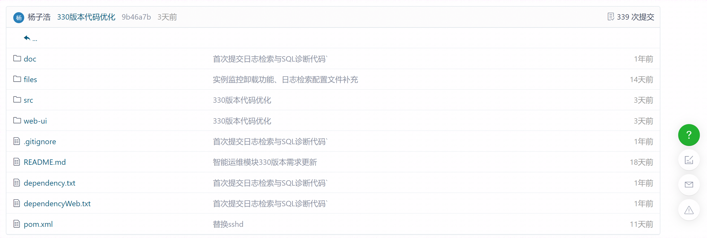

日志检索插件项目结构说明如下：

| 文件夹/文件 | 说明                   |
| ----------- | ---------------------- |
| src         | 保存后端代码及资源文件 |
| web-ui      | 保存前端代码。         |
| .gitignore  | 提交git忽略的目录      |
| pom.xml     | 后端依赖项。           |
| LICENSE     | 许可证                 |

### 3.5 系统要求

​	本节介绍使用日志检索插件的最低系统要求。

**系统要求**

| 操作系统 | 版本           |
| -------- | -------------- |
| windows  | windows7及以上 |

**软件要求**

| 软件 | 规格         |
| ---- | ------------ |
| Java | jdk 11及以上 |

**数据库版本要求**

| 数据库    | 版本 |
| --------- | ---- |
| openGauss | 所有 |


## 4 部署日志检索插件

​	 本章详细介绍如何部署日志检索插件。

​     前端技术栈：Vue3.0 + TS + Element plus

​     后端技术栈：Java + Spring boot

### 4.1 编译项目并部署至一体化平台

**前置条件：** ① 安装 node.js，建议使用 v16 以上版本；

​                   ② 安装Java jdk （建议使用v11及以上版本） 和 maven 3.X。

**步骤 1：** 检查自动构建前端项目的配置是否为false；

```
在 plugins > observability-instance > pom.xml 下将以下值设为false：
<web.build.skip>false</web.build.skip>
<web.clean.skip>false</web.clean.skip>
```

**步骤 2：** 启动打包命令；

```
mvn clean package -P prod
```

**步骤 3：** 在target目录下找到生成的jar，安装到一体化平台。


### 4.2 启动后端项目

**前置条件**：安装Java jdk （建议使用v11及以上版本） 和 maven 3.X。

**步骤 1：** 使用idea打开项目，并配置好maven；

**步骤 2：** 通过启动后端命令与前端命令的方式进入，此方式受限制，详情请参见 3.3 约束和限制。

​                **步骤 2-1：** 找到 ObservabilityPluginApplication类，执行 main 函数；

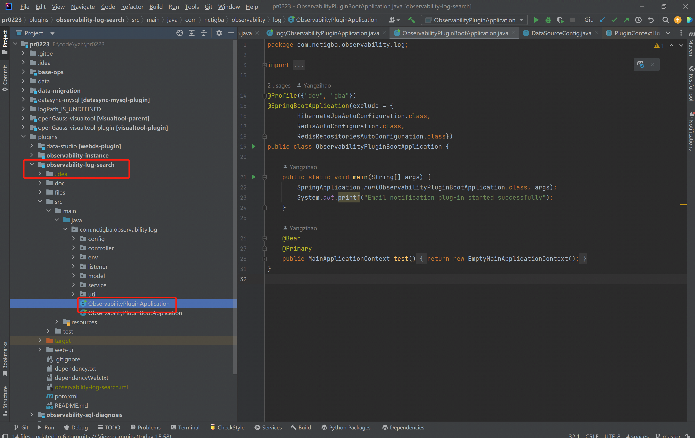

​             **步骤2-2：** 启动前端项目，请参见 4.3 启动前端项目。

**注**：项目基于spring-brick-bootstrap插件开发，目前项目只能以jar的形式运行于主平台，无法单独启动。若需要进行本地启动，需要修改ObservabilityPluginApplication类，参考https://www.yuque.com/starblues/spring-brick-3.0.0/xgf98o。

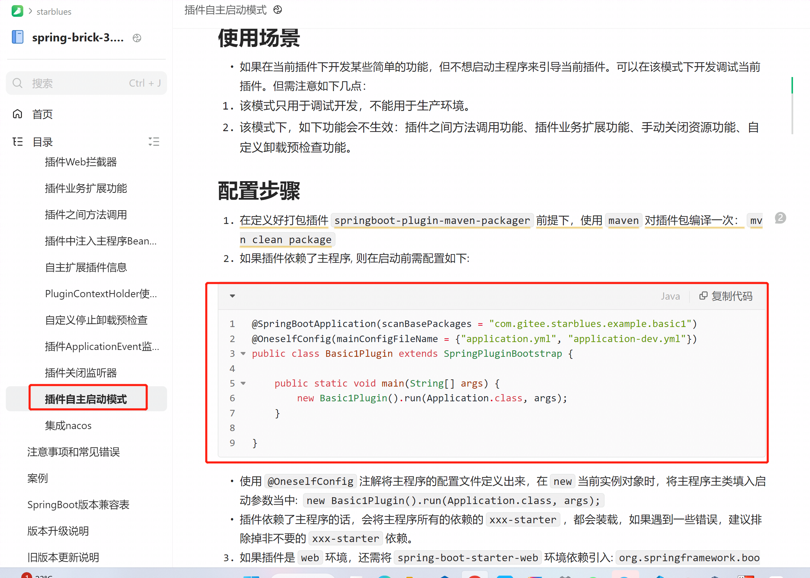


### 4.3 启动前端项目

**前置条件：** 安装 node.js，建议使用 v16 以上版本。

**步骤 1：** 下载依赖包

```
 任选以下一种命令：
 npm install
 yarn install
```

**步骤 2：** 启动前端项目

```
 根据package.json配置执行以下命令启动项目：
 npm run dev
```

**步骤 3：** 根据启动提示进入对应的URL地址，如下图所示：


## 5 日志检索插件

### 5.1 概述

​	本章详细介绍如何使用日志检索插件的功能。

### 5.2 部署服务端

1. 点击【日志检索】插件首页左上角的折叠按钮，打开【安装部署】侧边栏；

   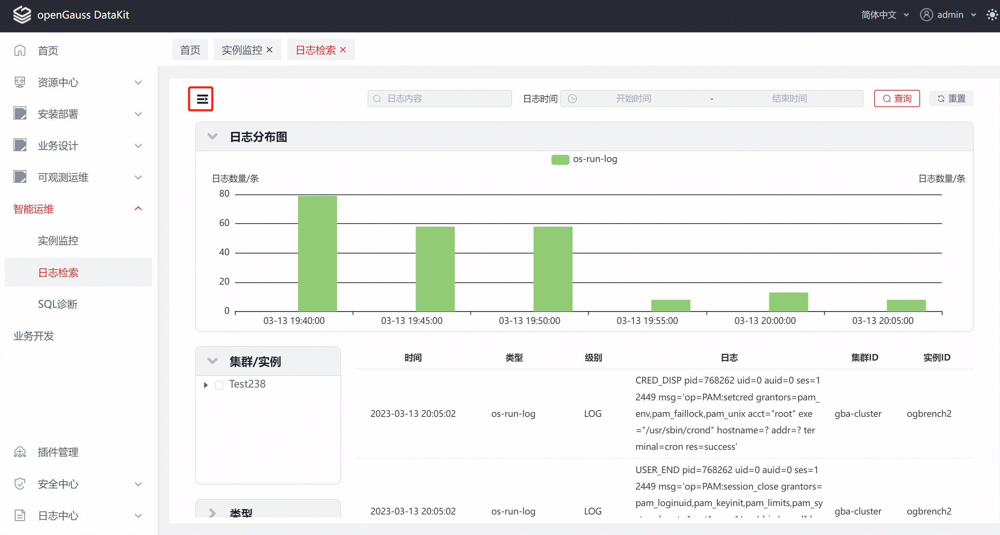

2. 点击【安装服务端】按钮，弹出安装框；

   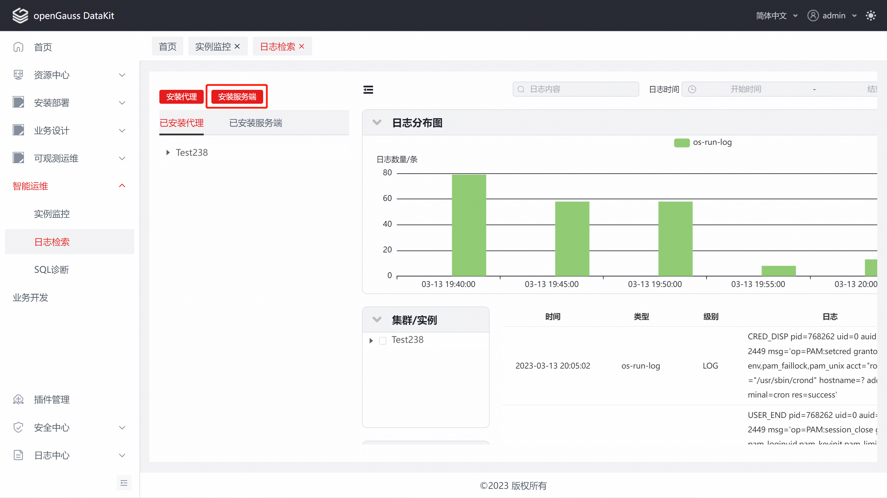

3. 选择对应物理机，输入Root密码以及相关信息，点击【一键部署】即可完成安装；

   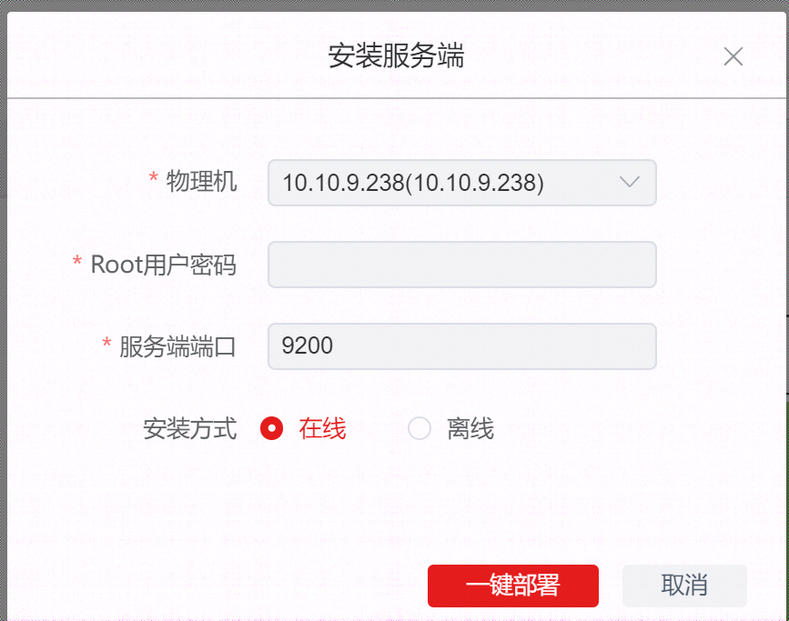

4. 安装完成后，即可在【已安装服务端】TAB中看到对应服务端的信息。

   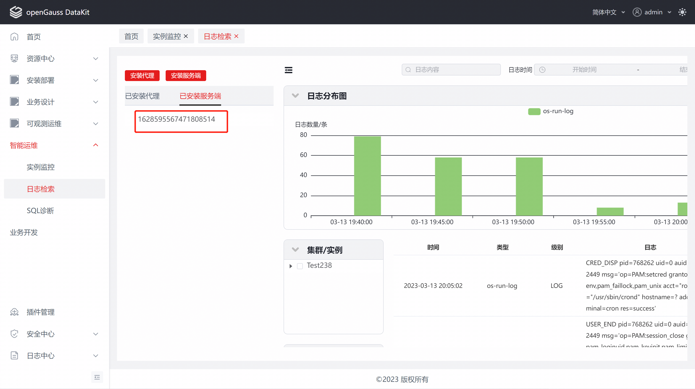

### 5.3 部署数据采集代理

1. 点击【安装代理】按钮，弹出安装框

   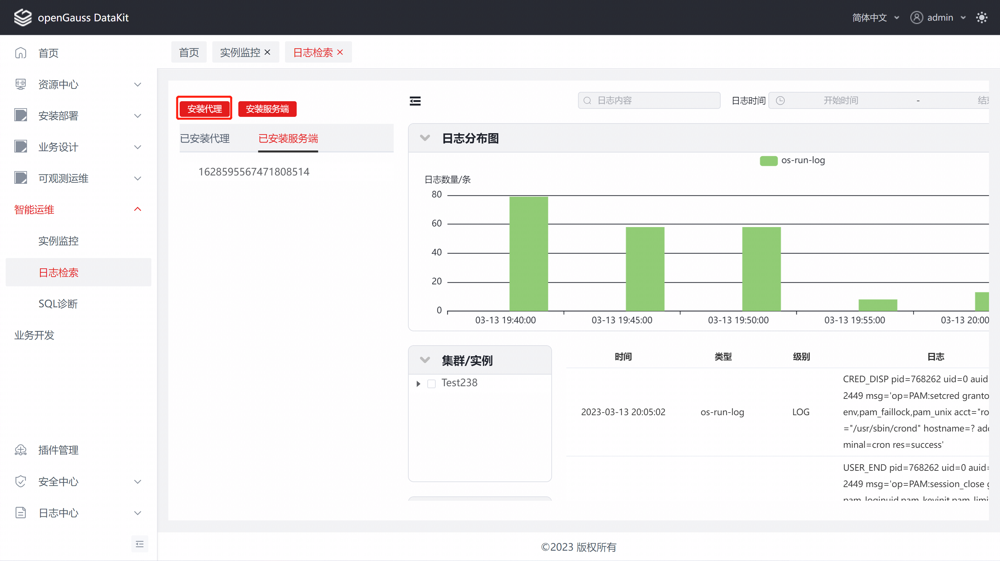

2. 选择对应数据库实例，输入Root密码，点击【一键部署】即可完成安装

   

3. 安装完成后，即可在【已安装代理】TAB中看到对应代理的信息

   


### 5.4 卸载

1、在【已安装服务端】和【已安装代理】列表中，鼠标悬停后会显示【卸载】按钮，点击【卸载】按钮，打开卸载窗口：

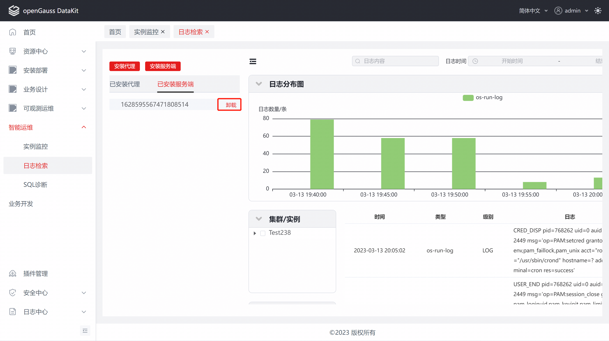

2、点击【一键卸载】，即可进行卸载操作。

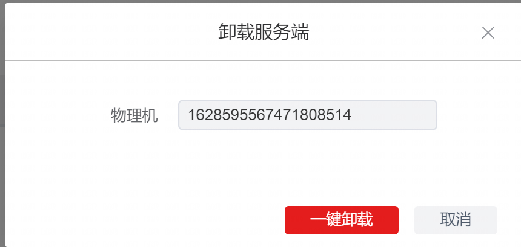

### 5.5 日志及日志上下文查询

1、在【日志检索】页面，输入对应的查询条件，点击【查询】，显示【日志分布图】和【日志列表】


2、选择某个【集群/实例】、【类型】、【级别】（可单选），将查询该实例的日志

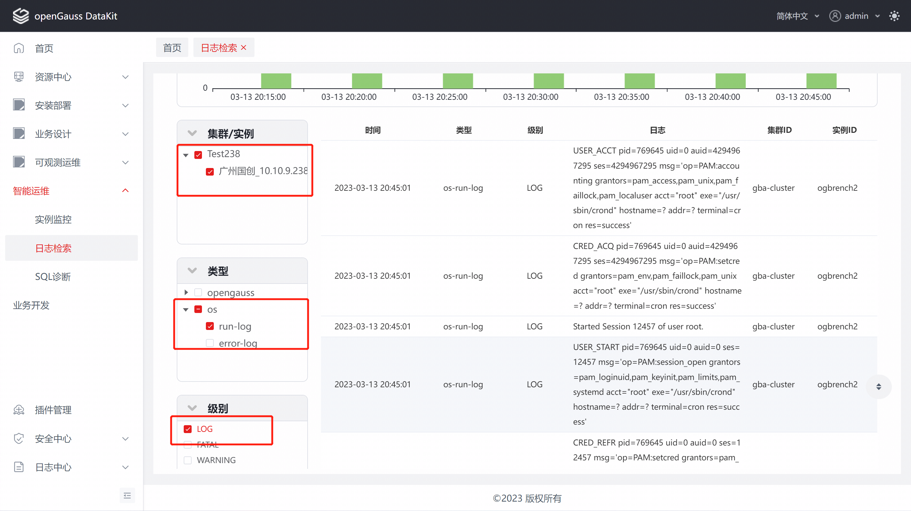

3、将鼠标移到列表中的日志，将在该日志右边显示【上下文】按钮图标，点击该图标，将打开新页面，查询日志上下文。

说明：在日志上下文中，该日志高亮

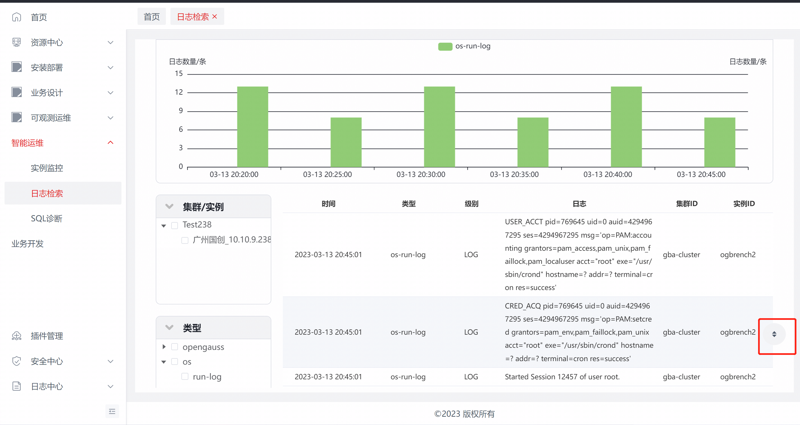


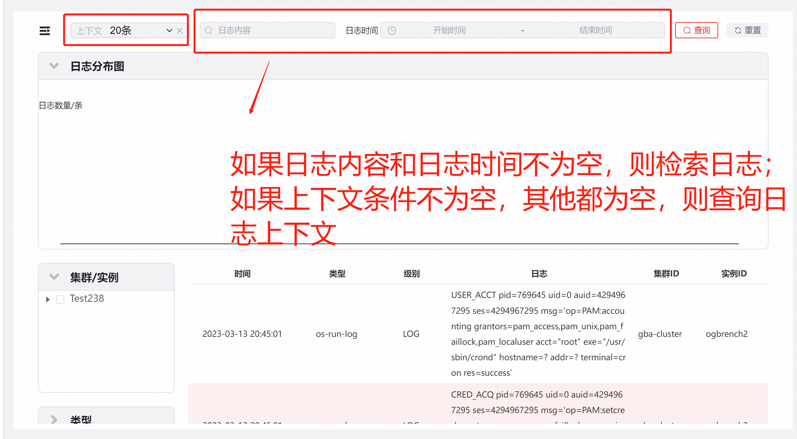

注：如果日志内容和日志时间不为空，则检索日志；如果上下文条件不为空，其他都为空，则查询日志上下文


## 6 FAQS

无